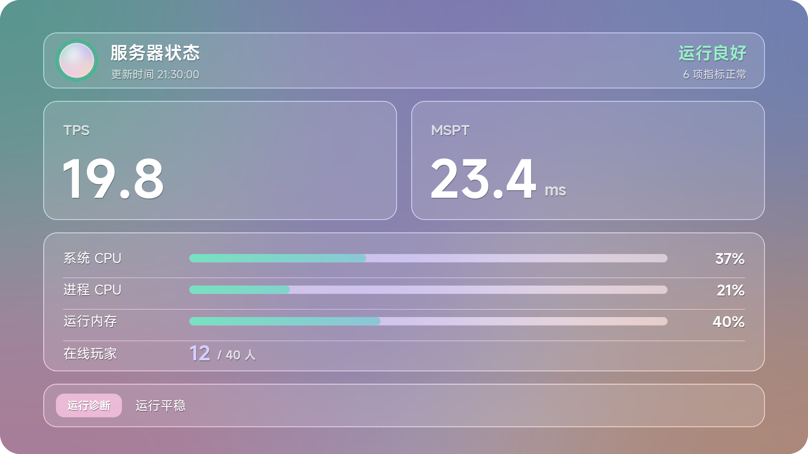
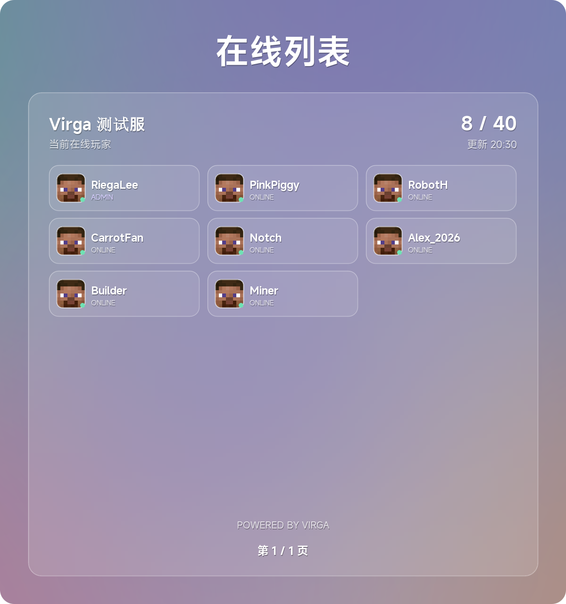
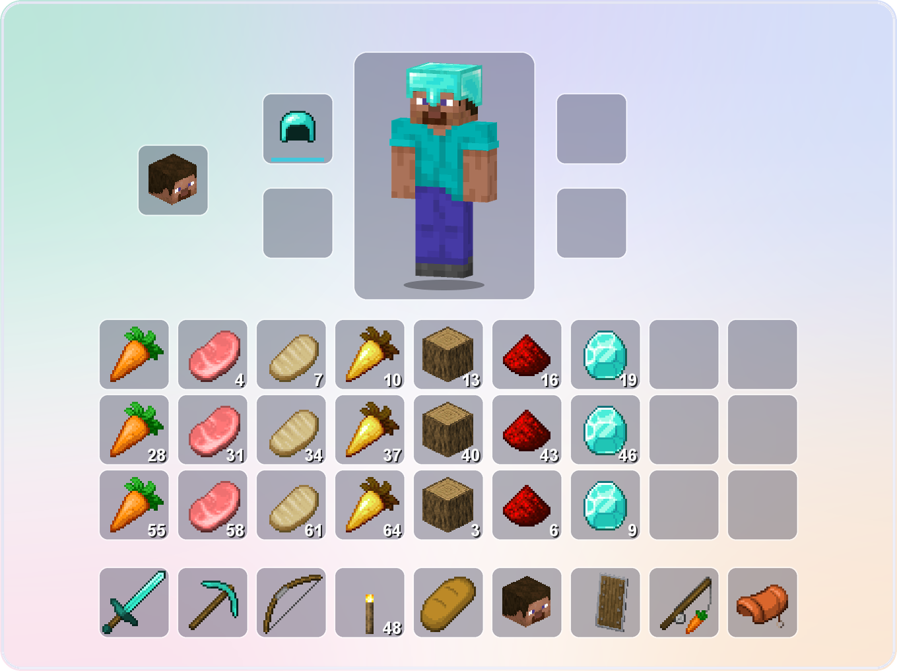
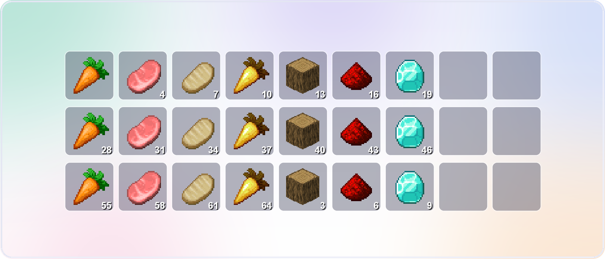

# Virga

把你的 Minecraft 服务器和 QQ 群连起来：群友在群里发一句指令，就能看到谁在线、服务器卡不卡、自己的背包里有什么；
游戏里的聊天和群聊也可以互相转发。

Virga 是 HuHoBot 的 Fork 分支，通过 **QQ 官方机器人** 接入 QQ 群。这里是它的 **Forge 版本**：

- 适用于 **Minecraft 1.20.1** 的 **Forge（47.x）** 和 **NeoForge（47.1.x）** 服务器，两者用同一个文件
- 只装在 **服务器** 上，玩家不需要安装任何东西
- 不需要其他前置模组

## 效果预览

以下为示例数据的实际出图。

**服务器状态**



**在线列表**



**背包**



**末影箱**



## 群里能用的指令

| 指令 | 作用 |
| --- | --- |
| `/帮助` | 列出当前这个群里你能用的指令 |
| `/在线列表 [页码]` | 在线玩家图片，带皮肤头像和管理标记；`/查在线` 是文字版 |
| `/服务器状态` | TPS、MSPT、CPU、内存和在线人数 |
| `/绑定 <验证码>` | 把 QQ 和游戏账号绑定起来（验证码在进服时自动发给玩家） |
| `/查绑`、`/查归属`、`/解绑`、`/设置主账号` | 查看、解除绑定；一个 QQ 绑了多个账号时可以选主账号 |
| `/我的背包`、`/我的末影箱` | 自己的背包或末影箱图片，带 3D 人物、盔甲、药水颜色；不在线时显示最后一次下线时的样子 |
| `/加管理`、`/删管理`、`/查管理` | 设置本群的 Virga 管理员（默认仅管理群） |
| `/执行命令` | 在群里执行服务器命令（默认关闭，仅超级管理员） |

除此之外，还可以：

- 游戏聊天和 QQ 群消息互相转发
- 玩家进服、退服时在群里提醒（默认关闭）
- 自己定义新的 QQ 指令，每个群单独设置能用哪些指令
- 要求玩家必须绑定 QQ 才能进服（可选）

## 安装

1. 把 `Virga-forge-1.20.1-<版本>.jar` 放进服务器的 `mods` 文件夹。
2. 启动一次服务器。Virga 会生成配置文件夹 `config/virga/`，并在控制台显示一次管理面板密码，请记下来。
3. 连接 QQ 机器人（见下一节）。
4. 把机器人接入你的 QQ 群（见“接入 QQ 群”）。

> 服务器需要用 **Java 17～21** 启动。Forge / NeoForge 1.20.1 本身不支持更新的 Java，
> 用 Java 22 及以上会在启动时报 `Unsupported class file major version`，这和 Virga 无关。

## 连接 QQ 机器人

三种方式任选其一：

- **游戏里扫码（推荐）**：OP 在游戏里输入 `/virga connect`，手上会拿到一张画着二维码的地图，用手机 QQ 扫码确认即可。
  连接成功后地图会自动收回；二维码 2 分钟内有效。
- **管理面板扫码**：在管理面板里点击连接，用手机 QQ 扫码。

扫码方式确认后会自动保存并连接，不需要重启。
- **手动填写**：在 `config/virga/config.yml` 里填好 QQ 机器人的 AppID 和 Secret，把 `bot.enabled` 改为 `true`，然后重启服务器。

## 接入 QQ 群

1. OP 在游戏里输入 `/virga group add`，接下来 10 分钟可以接入新群。
2. 让群主或群管理员在群里 @机器人，随便发一句话。
3. 回到游戏，点击聊天栏里的 **[确认接入]**。

## 游戏里的命令

| 命令 | 谁能用 | 作用 |
| --- | --- | --- |
| `/virga menu` | 管理员 | 打开设置菜单，点一下就能修改开关和数值，立即生效 |
| `/virga connect` | 管理员 | 用地图上的二维码连接 QQ 机器人 |
| `/virga group add` | 管理员 | 接入一个新的 QQ 群 |
| `/virga address [地址\|clear]` | 管理员 | 设置群友问“服务器地址”时回复的地址（默认不回复） |
| `/virga reload` | 管理员 | 重新读取配置和文案，不会断开 QQ |
| `/virga preview [玩家]` | 管理员 | 不经过 QQ，直接把各张图片生成到 `config/virga/preview/` 预览 |
| `/virga panel` | 管理员 | 查看管理面板状态 |
| `/virga passwd [新密码]` | 控制台 | 修改管理面板密码，不填则随机生成 |
| `/virga info` | 所有人 | 查看 Virga 的运行状态 |
| `/authcode` | 玩家 | 重新领取绑定验证码 |

“管理员”默认指 OP 等级 2 及以上的玩家。装了 LuckPerms 这类权限模组时，也可以用权限节点 `virga.admin` 单独授权。

## 管理面板

Virga 自带一个网页版管理面板，可以连接机器人、管理允许的群、按群设置指令、设置管理员和功能开关。

为了安全，面板只允许服务器本机访问（`127.0.0.1:56789`）。在自己电脑上打开时，先用 SSH 建立隧道：

```
ssh -N -L 127.0.0.1:56789:127.0.0.1:56789 你的服务器
```

然后在浏览器打开 `http://127.0.0.1:56789/`，输入第一次启动时控制台显示的密码。
忘记密码可以在控制台输入 `/virga passwd` 重新设置。不方便用面板时，游戏里的 `/virga connect` 和 `/virga menu` 也够用。

## 换成自己的背景图

把图片放进 `config/virga/backgrounds/`，文件名如下（支持 .png / .jpg / .jpeg）。只替换最底下的背景，卡片和文字位置不变；
卡片下面的背景会自动模糊，图片再花也不影响看清内容。

| 文件名 | 用在哪张图 | 建议尺寸 |
| --- | --- | --- |
| `online-list` | 在线列表 | 1792×1008 |
| `status` | 服务器状态 | 1792×1008 |
| `inventory` | 背包 | 1359×1017 |
| `ender-chest` | 末影箱 | 1620×694 |

尺寸不一样时会自动等比缩放并居中裁切。换图后下一次出图就生效，不需要重启。
在 `/virga menu` 或管理面板里可以关闭自定义背景，或调整盖在背景上的柔光强度。

## 常见问题

**玩家怎么绑定 QQ？**
没绑定的玩家进服后会自动收到一个验证码，在群里发 `/绑定 验证码` 即可。验证码过期了可以在游戏里输入 `/authcode` 重新领取。

**离线模式（盗版）服务器能用吗？**
能用。但 Virga 不负责登录验证，需要防止冒名进服时请另外安装登录类模组。

**Virga 的数据存在哪？会越来越大吗？**
都在 `config/virga/` 下。Virga 每天会自动清理一次：超过 30 天的缓存、180 天没上线的玩家的离线背包和皮肤会被删除。
天数可以在 `config.yml` 的 `storage` 一节修改。

**文案可以改吗？**
可以，修改 `config/virga/messages.yml` 后执行 `/virga reload`。

<details>
<summary>给开发者</summary>

- 用 JDK 21 执行 `./gradlew clean build`，产物在 `build/gather-jar/`；管理面板前端需要 Node（`VIRGA_NODE_HOME` 指向 Node 目录）。
  建议在纯英文路径下构建。
- 想为 Virga 写附属模组：扩展 API 在 `cn.huohuas001.virga.api`（`virga-api` 模块），与 HuHoBot 生态的包名一致。

</details>

## 许可与致谢

- Virga 以 [AGPL-3.0](LICENSE.txt) 发布，核心代码派生自 HuHoBot PenguinClient。
- QQ 机器人 SDK（`deps/qqpd-bot-java`）保留其原有来源与许可。
- 物品图标来自 Faithful 32x 材质包（Faithful License，见 [INVENTORY_THIRD_PARTY_NOTICES.md](INVENTORY_THIRD_PARTY_NOTICES.md)）。
- 状态卡与在线列表内置了 MiSans（© 小米）字体的子集。
